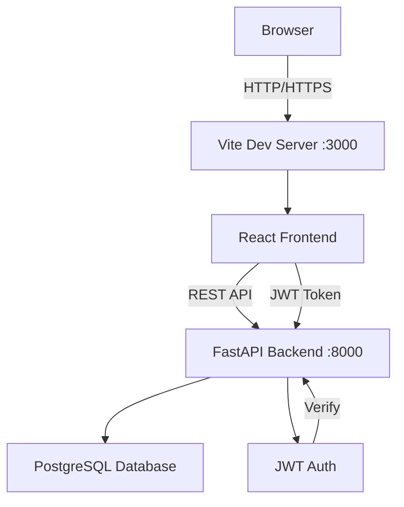

# Instructions: Architecture Design

**Purpose**: Transform requirements into a concrete architecture with API contracts and implementation plan.

---

## Process Overview

```
REQUIREMENTS.md 
    ↓
Scan Codebase (understand existing patterns)
    ↓
Design Components (what needs to change/be created)
    ↓
Define API Contract (exact endpoints, request/response)
    ↓
Identify Impacted Files (what to modify/create)
    ↓
ARCHITECTURE.md
```

---

## Step-by-Step Procedure

### Step 1: Read Requirements

Load `REQUIREMENTS.md` and extract:
- Functional requirements (FRs)
- Acceptance criteria (ACs)
- Actors and their permissions
- Non-functional requirements (NFRs)

Create a mental map:
```
FR-1: Search books by keyword
  ↓ needs...
  - GET /api/books/search endpoint
  - Query parameter: q (keyword)
  - Filter logic in backend
  - Search UI in frontend
```

### Step 2: Scan Existing Codebase

Understand current architecture:

**Backend (`backend/app/`):**
```bash
# Existing routers
ls backend/app/routers/

# Existing models
ls backend/app/models/

# Existing schemas
ls backend/app/schemas/

# Check main.py for registered routers
grep "app.include_router" backend/app/main.py
```

**Frontend (`frontend/src/`):**
```bash
# Existing pages
ls frontend/src/pages/

# Existing services
ls frontend/src/services/

# Check App.tsx for routes
grep "Route path=" frontend/src/App.tsx
```

**Key patterns to identify:**
- Auth pattern: How are JWT guards used?
- Error handling: How are 404, 409, etc. returned?
- Pagination: Is it used? What pattern?
- Validation: Pydantic schemas at API boundary?

### Step 3: Design High-Level Architecture

Create a Mermaid component diagram:



Identify components:
- **Frontend**: React pages, components, services
- **Backend**: FastAPI routers, SQLAlchemy models, Pydantic schemas
- **Database**: Tables, relationships, indexes
- **Auth**: JWT verification, role-based guards

### Step 4: Define Technology Stack

Use consistent technologies from CLAUDE.md:

| Layer | Technology | Version |
|-------|-----------|---------|
| Frontend | React + TypeScript | 18 |
| Styling | Tailwind CSS | 3.x |
| Backend | FastAPI | 0.x |
| ORM | SQLAlchemy | 2.0 |
| Validation | Pydantic | v2 |
| Database | PostgreSQL | 15 |
| Auth | JWT (python-jose) | - |

### Step 5: Map Data Flow

Describe the numbered sequence:

```
1. User enters search keyword in SearchPage.tsx
2. Frontend calls bookService.search(keyword)
3. Service sends GET /api/books/search?q=keyword
4. Backend router receives request
5. Router validates query param (Pydantic)
6. Router queries database with LIKE filter
7. SQLAlchemy returns matching books
8. Pydantic schema serializes response
9. JSON response sent to frontend
10. React updates UI with results
```

### Step 6: Design API Contract

For each endpoint, specify:

```markdown
### GET /api/books/search

**Description**: Search books by keyword (title, author, ISBN)

**Auth**: Public (no auth required) | JWT required (member, librarian, admin)

**Query Parameters**:
- `q` (string, required): Search keyword
- `limit` (int, optional): Results per page (default: 20)
- `offset` (int, optional): Pagination offset (default: 0)

**Request Example**:
```
GET /api/books/search?q=gatsby&limit=10&offset=0
Authorization: Bearer <jwt_token>
```

**Response 200 OK**:
```json
{
  "total": 2,
  "results": [
    {
      "id": 1,
      "title": "The Great Gatsby",
      "author": "F. Scott Fitzgerald",
      "isbn": "9780743273565",
      "available_copies": 3
    }
  ]
}
```

**Response 400 Bad Request**:
```json
{
  "detail": "Query parameter 'q' is required"
}
```

**Response 401 Unauthorized**:
```json
{
  "detail": "Not authenticated"
}
```

**Notes**:
- Case-insensitive search
- Searches across title, author, and ISBN fields
- Uses SQL ILIKE for partial matching
```

### Step 7: Identify Impacted Files

List every file that needs modification or creation:

**Files to Create:**
| File | Purpose |
|------|---------|
| `backend/app/routers/search.py` | Search endpoint router |
| `backend/app/schemas/search.py` | Search request/response schemas |
| `frontend/src/pages/SearchPage.tsx` | Search UI page |
| `frontend/src/services/searchService.ts` | Search API client |
| `backend/tests/test_search.py` | Unit tests for search |
| `tests/e2e/search.spec.ts` | E2E tests for search |

**Files to Modify:**
| File | Change |
|------|--------|
| `backend/app/main.py` | Add `app.include_router(search.router)` |
| `frontend/src/App.tsx` | Add `<Route path="/search" element={<SearchPage />} />` |
| `backend/app/models/book.py` | (No changes needed - table exists) |

### Step 8: Design Database Changes

Specify schema modifications:

**Option A: No changes needed**
```
Existing `books` table has all required fields:
- id, title, author, isbn, available_copies

No migrations required.
```

**Option B: New table needed**
```
Create migration for `search_history` table:
- id (PK)
- user_id (FK to users)
- query (text)
- searched_at (timestamp)

Command: alembic revision --autogenerate -m "add search history"
```

**Option C: Add index**
```
Add GIN index on books.title for faster full-text search:

CREATE INDEX idx_books_title_gin ON books USING GIN(to_tsvector('english', title));
```

### Step 9: Consider NFRs

Address non-functional requirements:

**Performance (NFR-1: Response < 2s)**
- Use database indexes on searchable columns
- Implement pagination (limit/offset)
- Consider caching for popular queries

**Security (NFR-2: All routes require auth)**
- Add `Depends(get_current_user)` to endpoint
- Validate all input with Pydantic schemas
- Sanitize search query to prevent SQL injection (SQLAlchemy handles this)

**Scalability (NFR-3: Support 1000 concurrent users)**
- Use connection pooling (SQLAlchemy default)
- Implement rate limiting on search endpoint
- Consider ElasticSearch for very large catalogs (future)

### Step 10: Write ARCHITECTURE.md

Create the final document with all sections:

```markdown
# Architecture: [Feature Title]

**REQ-ID**: REQ-XXX
**Date**: YYYY-MM-DD
**Status**: Draft | Approved

## High-Level System Architecture

[Mermaid diagram from Step 3]

## Technology Stack

[Table from Step 4]

## Data Flow

[Numbered steps from Step 5]

## API Contract

[All endpoints from Step 6]

## Impacted Files

[Tables from Step 7]

## Database Schema Changes

[Details from Step 8]

## Security Considerations

- Authentication: [How JWT is used]
- Authorization: [Role-based access control]
- Input Validation: [Pydantic schemas at boundary]
- SQL Injection: [Protected by SQLAlchemy ORM]

## Non-Functional Requirements

[How NFRs are addressed from Step 9]

## Error Handling

[Standard error response format]

## Testing Strategy

- Unit tests: Test routers, models, schemas in isolation
- Integration tests: Test API endpoints with test database
- E2E tests: Test full user flows in browser

## Deployment Considerations

- Environment variables: [Any new .env vars needed]
- Migrations: [Database migration steps if any]
- Dependencies: [Any new packages to install]

## Open Questions

[Any unresolved decisions or assumptions to validate]
```

---

## Best Practices

### API Design

✅ **RESTful conventions:**
- GET for reads
- POST for creates
- PUT/PATCH for updates
- DELETE for removes

✅ **Consistent response format:**
```json
{
  "data": { ... },
  "error": null
}
```

✅ **Standard status codes:**
- 200 OK
- 201 Created
- 204 No Content
- 400 Bad Request
- 401 Unauthorized
- 403 Forbidden
- 404 Not Found
- 409 Conflict
- 422 Validation Error
- 500 Internal Server Error

### Database Design

✅ **Indexes on foreign keys** - Faster joins
✅ **Unique constraints** - Prevent duplicates (e.g., ISBN)
✅ **NOT NULL where appropriate** - Data integrity
✅ **Timestamps** - created_at, updated_at for auditability

### Security by Default

✅ **Auth on all routes** (except public endpoints like login)
✅ **Pydantic validation** at API boundary
✅ **Role-based access control** in routers
✅ **No secrets in code** - use environment variables

---

## Common Patterns

### CRUD Endpoints

```markdown
### POST /api/books
**Auth**: librarian, admin
**Request**: BookCreate schema
**Response 201**: BookResponse
**Response 409**: Duplicate ISBN

### GET /api/books/{id}
**Auth**: member, librarian, admin
**Response 200**: BookResponse
**Response 404**: Book not found

### PUT /api/books/{id}
**Auth**: librarian, admin
**Request**: BookUpdate schema
**Response 200**: BookResponse
**Response 404**: Book not found

### DELETE /api/books/{id}
**Auth**: admin only
**Response 204**: No content
**Response 404**: Book not found
**Response 409**: Book has active borrows
```

### Search/Filter Endpoints

```markdown
### GET /api/books
**Query Params**:
- q: search keyword
- author: filter by author
- limit: pagination
- offset: pagination

**Response**: Paginated list with total count
```

### Business Logic Endpoints

```markdown
### POST /api/books/{id}/borrow
**Auth**: member, librarian, admin
**Response 200**: Transaction created
**Response 404**: Book not found
**Response 409**: Book not available
**Response 403**: User has too many active borrows
```

---

## Validation Checklist

Before finalizing ARCHITECTURE.md:

- [ ] Every FR from REQUIREMENTS.md has a corresponding endpoint
- [ ] Every endpoint specifies auth requirements
- [ ] All request/response schemas defined
- [ ] Error cases documented (404, 409, 401, 403, etc.)
- [ ] Database changes identified and migration plan noted
- [ ] NFRs addressed (performance, security, scalability)
- [ ] Files to modify/create listed explicitly
- [ ] Mermaid diagram shows all components
- [ ] Data flow covers full request/response cycle
- [ ] No ambiguity - a developer could implement from this alone

---

## Output Format

The final ARCHITECTURE.md should be:
- ✅ **Complete** - Everything needed to implement
- ✅ **Unambiguous** - No guessing required
- ✅ **Reviewable** - Easy for humans to validate
- ✅ **Testable** - Clear success criteria for each endpoint
- ✅ **Consistent** - Follows project patterns from CLAUDE.md
