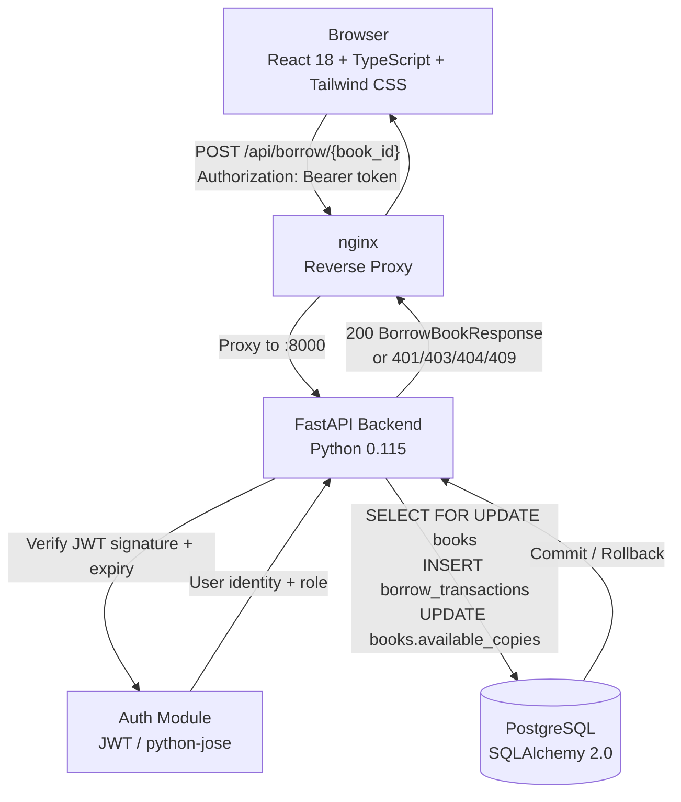

# Architecture: FR-3.1 Borrow a Book

## High-Level System Architecture



## Technology Stack

| Component | Technology | Responsibility |
|-----------|------------|----------------|
| Frontend | React 18 + TypeScript + Vite + Tailwind CSS | Borrow button, borrowService, toast feedback |
| HTTP Client | Axios (`services/api.ts`) | Bearer token injection on every request |
| API Gateway | nginx | Reverse proxy to FastAPI |
| Backend | Python FastAPI 0.115 + Pydantic v2 | Validation, business rules, response shaping |
| Auth | JWT (python-jose) + passlib/bcrypt | Token decode, role extraction |
| ORM | SQLAlchemy 2.0 | `SELECT FOR UPDATE` row lock, atomic commit |
| Database | PostgreSQL (psycopg2-binary) | Persistent storage, concurrency isolation |

## Data Flow

1. Member clicks "Borrow" → `borrowService.borrowBook(bookId)` → `POST /api/borrow/{book_id}` with Bearer token
2. nginx routes to FastAPI port 8000
3. `HTTPBearer(auto_error=False)` extracts credentials; absent → **401 Unauthorized**
4. `decode_token()` validates JWT; invalid/expired → **401 Unauthorized**
5. `get_current_user()` fetches User from DB via `sub` claim
6. Non-member role check (guest, admin, librarian) → **403 Forbidden**
7. Active borrow count ≥ 5 → **409 Conflict**
8. Duplicate active borrow (same user + book) → **409 Conflict**
9. `SELECT ... FOR UPDATE` locks books row; reads `available_copies`
10. `available_copies == 0` → **409 Conflict**, rollback
11. `INSERT INTO borrow_transactions` (status=Borrowed, borrowed_at=now(), due_date=now()+14d)
12. `UPDATE books SET available_copies = available_copies - 1`
13. `db.commit()` — atomic; failure triggers full rollback
14. Return `BorrowBookResponse` → frontend updates local state + success toast

## Impacted Files

### Files Modified

| File | Change |
|------|--------|
| `backend/app/auth/dependencies.py` | `HTTPBearer(auto_error=False)` + explicit 401 for missing token |
| `frontend/src/pages/BooksPage.tsx` | Borrow button, `handleBorrow()`, `borrowingBookId` state |

### Files Created

| File | Purpose |
|------|---------|
| `backend/app/routers/borrow.py` | `POST /api/borrow/{book_id}` endpoint |
| `backend/app/models/borrow_transaction.py` | `BorrowTransaction` ORM model |
| `backend/app/schemas/borrow_transaction.py` | `BorrowBookResponse` Pydantic v2 schema |
| `frontend/src/services/borrowService.ts` | `borrowBook()` axios call |
| `frontend/src/types/borrowTransaction.ts` | TypeScript `BorrowBookResponse` interface |
| `backend/tests/test_borrow.py` | 7 pytest tests covering all acceptance criteria |

### Database Changes

- New table: `borrow_transactions` (`id` UUID PK, `user_id` FK→users, `book_id` FK→books, `borrowed_at` TIMESTAMPTZ, `due_date` TIMESTAMPTZ, `returned_at` TIMESTAMPTZ NULL, `status` VARCHAR(20))
- `books.available_copies` decremented by 1 on every successful borrow

## API Contract

### POST /api/borrow/{book_id}

- **Auth**: Bearer JWT required — role must be `member`
- **Path param**: `book_id` (UUID string)
- **Request body**: none

**Response 200:**
```json
{
  "transaction_id": "uuid",
  "book_id": "uuid",
  "user_id": "uuid",
  "borrowed_at": "2026-06-02T10:00:00Z",
  "due_date": "2026-06-16T10:00:00Z",
  "status": "Borrowed"
}
```

| Status | Condition | Detail |
|--------|-----------|--------|
| 401 | Missing or expired JWT | `"Not authenticated"` |
| 403 | Role is guest / admin / librarian | `"Guest users cannot borrow books"` |
| 404 | `book_id` not found | `"Book not found"` |
| 409 | `available_copies == 0` | `"Book is not available for borrowing"` |
| 409 | Same user already has active borrow for this book | `"You already have an active borrow for this book"` |
| 409 | User has 5 active borrows | `"You have reached the maximum limit of 5 active borrows"` |
